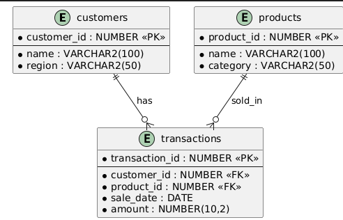
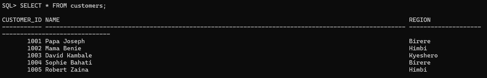
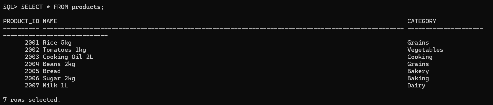
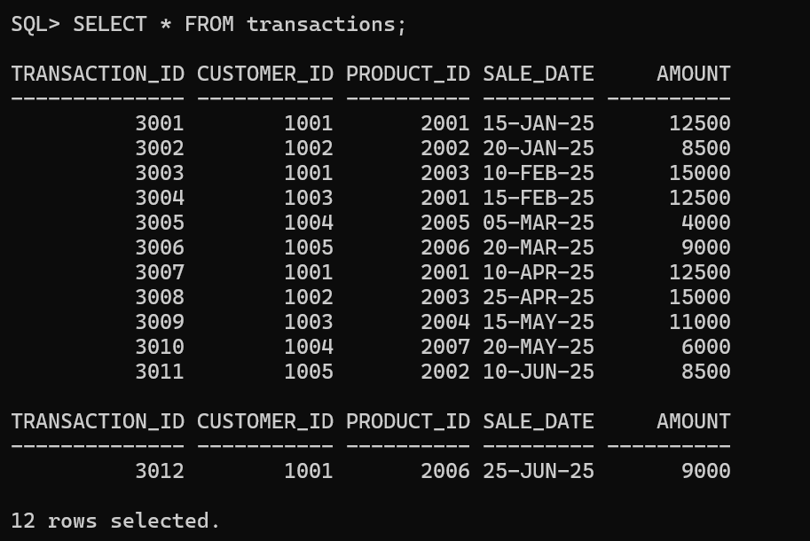
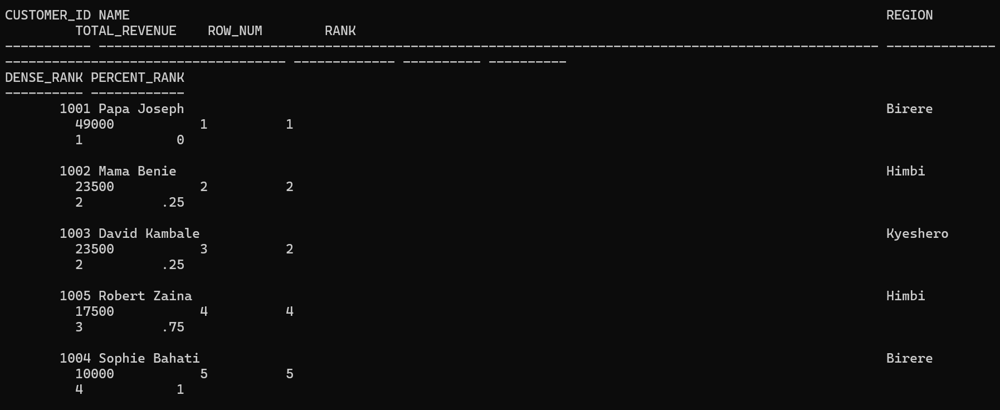
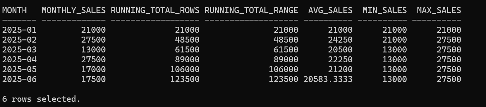
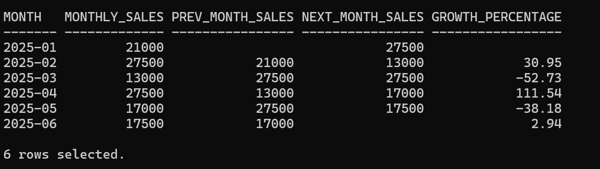
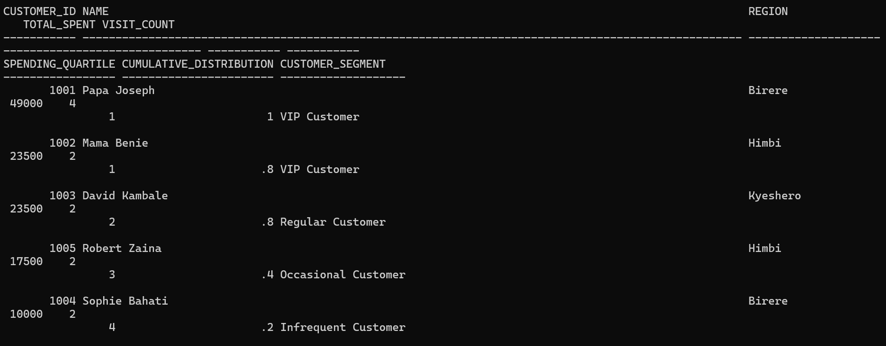

# PL/SQL Window Functions - Goma Fresh Foods Analysis

## Student Information
- **Name:** Benie Kasemire
- **Course:** Database Development with PL/SQL (INSY 8311)
- **Instructor:** Eric Maniraguha
- **Submission Date:** 29th September 2025

## Business Problem

### Business Context: 
Located in Goma, DRC, Goma Fresh Foods is a neighborhood grocery chain that serves clients in several communities by selling groceries, dairy goods, and fresh produce.  The management must examine consumer buying trends and regional sales performance.

### Data Challenge: 
 The business is unable to classify clients based on their purchasing value, follow monthly revenue patterns across regions, or determine which goods work best in each area.  As a result, inventory distribution and regional marketing initiatives are ineffective.

### Expected result: 
 "Identify top products per region, analyze customer frequency, and segment customers for marketing."

---

## Success Criteria 
Define exactly 5 measurable goals:
- 1. Top 5 products per region/quarter → RANK()
- 2. Running monthly sales totals → SUM() OVER()
- 3. Month-over-month growth → LAG()/LEAD()
- 4. Customer quartiles → NTILE(4)
- 5. 3-month moving averages → AVG() OVER()

---

## Database Schema
- **customers:** customer_id (PK), name, region  
- **products:** product_id (PK), name, category  
- **transactions:** transaction_id (PK), customer_id (FK), product_id (FK), sale_date, amount  

**Database Script:** [tables.sql](database/tables.sql)  
**ER Diagram:**  

---

## View Data in each Table
**Customers Table:**  

**Products Table:**  

**Transactions Table:**  

---

## Window Functions Implementation

### 1. Ranking: Use case → Top N customers by revenue
- **Script:** [ranking.sql](scripts/ranking.sql)  
- **Functions:** ROW_NUMBER(), RANK(), DENSE_RANK(), PERCENT_RANK()  
- **Result:**  

---

### 2. Aggregate: Use case → Running totals & trends
- **Script:** [aggregation.sql](scripts/aggregation.sql)  
- **Functions:** SUM(), AVG(), MIN(), MAX() with ROWS vs RANGE  
- **Result:**  

---

### 3. Navigation: Use case → Period-to-period analysis
- **Script:** [navigation.sql](scripts/navigation.sql)  
- **Functions:** LAG(), LEAD() with growth calculations  
- **Result:**  

---

### 4. Distribution: Use case → Customer segmentation
- **Script:** [distribution.sql](scripts/distribution.sql)  
- **Functions:** NTILE(4), CUME_DIST()  
- **Result:**  

---

### 1. Descriptive: What took place?

 * **Customer spending patterns**: Sophie Bahati and Robert Zaina have **lower total spending** and fewer transactions, whereas Papa Joseph is the **highest spender** with numerous purchases in several product categories (grains, cooking oil, and sugar).
 * **Monthly sales trends**: From January (12,500) to April (27,500), sales income rose gradually. It peaked in April, but then fluctuated in May (17,000) and June (17,500).
 * **Outliers**: Due to high-value transactions (Mama Benie sold 15,000 units in April), there are significant spikes.

### 2. Why is it diagnostic?

 Because they favor **high-value items** (grains, cooking oil, and sugar) and make **repeat purchases**, **high spenders** (like Papa Joseph) donate more.
 * **Regions**: Birere customers (such as Papa Joseph and Sophie Bahati) seem engaged, but their contributions vary; Joseph generates the most of the income, while Sophie makes less.
 * **Monthly variation**: Mama Benie's big cooking oil purchase in April caused a jump in sales, while May and June saw a decline as only one or smaller-value purchases were made.
 * **Segments**: Quartile analysis reveals that **infrequent customers (lowest 25%)** make few purchases and contribute very little, while **VIP customers (top 25%)** are few yet account for the majority of sales.

### 3. Prescriptive: What comes next?

 * **Retain VIPs**: To keep income flowing, offer discounts or loyalty rewards to high-spending clients (like Papa Joseph and Mama Benie).
 * **Involve Infrequent Customers**: To encourage more frequent purchases, target Sophie Bahati and Robert Zaina with tailored promos, modest package deals, or bundled offerings.
 Seasonal sales should be balanced.  Plan **stocking and promotions** ahead of high-sales months and launch marketing campaigns in low-activity months (e.g., May, June) because sales peaked in April.
 * **Product strategy**: To enhance the size of the basket, bundle lower-demand items (like bread and milk) with higher-demand items (like rice and cooking oil).

---

## References

1. Oracle. *Oracle Database SQL Language Reference — Window Functions.* Oracle Docs.  
   [https://docs.oracle.com/en/database/oracle/oracle-database/19/lnpls/index.html](https://docs.oracle.com/en/database/oracle/oracle-database/19/sqlrf/Window-Functions.html)

2. Oracle. *Oracle Database PL/SQL Language Reference.* Oracle Docs.  
   [https://docs.oracle.com/en/database/oracle/oracle-database/19/lnpls/index.html](https://docs.oracle.com/en/database/oracle/oracle-database/19/lnpls/index.html)

3. Mode Analytics. *SQL Window Functions Tutorial.*  
   [https://mode.com/sql-tutorial/sql-window-functions/](https://mode.com/sql-tutorial/sql-window-functions/)

4. Percona Blog. *Use of Window Functions for Time Series.*  
   [https://www.percona.com/blog/using-sql-window-functions-for-time-series-analysis/](https://www.percona.com/blog/using-sql-window-functions-for-time-series-analysis/)

5. PostgreSQL Documentation. *NTILE, CUME_DIST and Percentile Functions.*  
   [https://www.postgresql.org/docs/current/functions-window.html](https://www.postgresql.org/docs/current/functions-window.html)

6. Use The Index, Luke! *Understanding SQL Window Functions.*  
   [https://use-the-index-luke.com/sql/window-functions](https://use-the-index-luke.com/sql/window-functions)

7. DataSchool. *Practical Guide to SQL Framing (ROWS vs RANGE).*  
   [https://dataschool.com/sql/rows-vs-range-in-window-functions/](https://dataschool.com/sql/rows-vs-range-in-window-functions/)

8. Vertabelo Blog. *Time Series Rolling Windows with SQL.*  
   [https://vertabelo.com/blog/sql-window-functions-and-time-series/](https://vertabelo.com/blog/sql-window-functions-and-time-series/)

9. Towards Data Science. *Customer Segmentation in SQL.*  
   [https://towardsdatascience.com/customer-segmentation-using-sql-window-functions](https://towardsdatascience.com/customer-segmentation-using-sql-window-functions)

10. KDNuggets. *Designing Analytics Schemas for Retail.*  
    [https://www.kdnuggets.com/2020/06/designing-analytics-schemas-retail.html](https://www.kdnuggets.com/2020/06/designing-analytics-schemas-retail.html)

---

## Academic Integrity Statement
"All sources were properly cited. Implementations and analysis represent original work. No AI-generated content was copied without attribution or adaptation."
